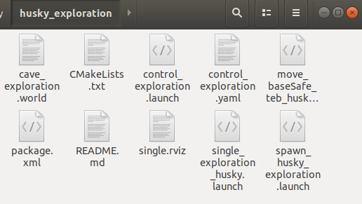
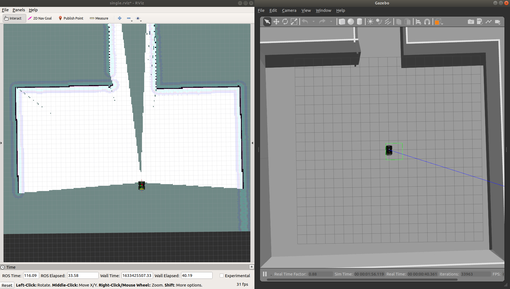
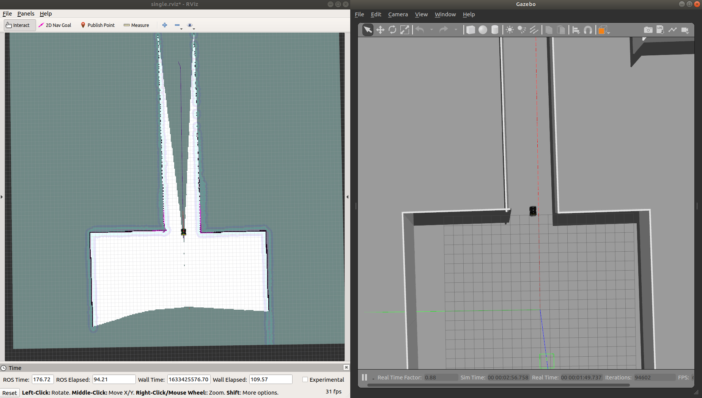
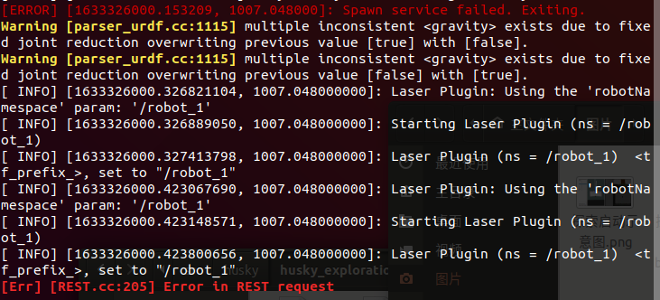
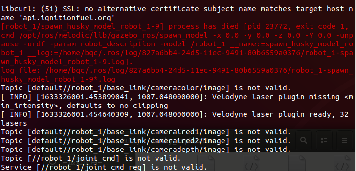
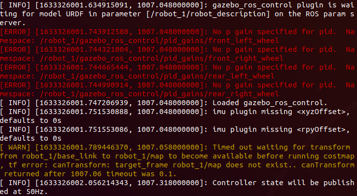

# 单机器人隧道探索配置工作

## 目录

- 软硬件平台及机器人模型准备

- 单机器人探索启动文件配置

## 1.软硬件平台及机器人模型准备

请参见 https://github.com/nkuwenjian/CNSubTRobotSetup 相关文件以及配置说明。
如果运行单机器人隧道探索有错误， husky 机器人模型也可以在下面的地址下载
https://github.com/qingchen-bi/husky-exploration

## 2.单机器人探索启动文件配置

请在 https://github.com/qingchen-bi/CNSubTRobotSetupForExploration.git 下载单机器人探索的启动配置文件

然后在 husky 文件夹下创建新的 ros 功能包，命名为 husky_exploration 

`catkin_create_pkg husky_exploration`

将下载的所有文件均复制到此文件夹下，复制完成后文件如图(没有显示fig文件夹)：

然后运行如下命令启动 husky 隧道探索

`roslaunch husky_exploration single_exploration_husky.launch`

如果出现下图所示内容表明启动配置成功

注意，修改 single_exploration_husky.launch 包含的 move_baseSafe_teb_husky.launch 中 TEB 参数配置文件的路径,或者换为自己计划使用的规划插件。
然后如下图所示，通过选择 RVIZ 界面左上角的 2D Nav Goal 给机器人随便发送一个导航目标点，如果机器人可以前往目标点，证明启动配置一切正常。 

并且，可以忽略下图所示错误内容：

